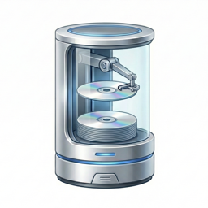
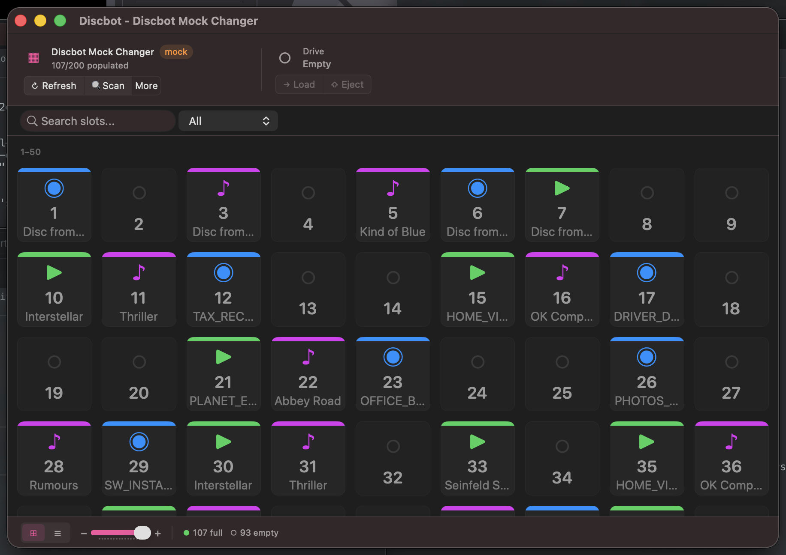

<p align="center">
  
</p>

<h1 align="center">Discbot</h1>

<p align="center">
  A macOS app for controlling SCSI media changer devices.<br>
  Built for the <a href="https://www.sony.com/electronics/support/home-video-media-changers/vgp-xl1b">Sony VGP-XL1B</a> 200-disc changer, but should work with other SCSI-compliant media changers.
</p>

<p align="center">
  
</p>

## Features

- **Visual inventory** — Grid and list views of all disc slots with color-coded status indicators
- **Disc operations** — Load, eject, mount, and unmount discs with a click or keyboard shortcut
- **Batch imaging** — Select multiple discs and image them to ISO files sequentially
- **Disc scanning** — Auto-detect disc type and volume label for any slot
- **Search and filter** — Find discs by name or filter by status (full, empty, imaged)
- **Zoom** — Adjustable grid tile size from compact to detailed
- **Keyboard navigation** — Arrow keys, Enter to load, Escape to deselect
- **Quit protection** — Warns before quitting during active operations and recovers gracefully from crashes

## Requirements

- macOS 10.15 (Catalina) through macOS 15 (Sequoia)
- A SCSI media changer connected via FireWire or Thunderbolt-to-FireWire adapter

> **Note:** macOS Tahoe (macOS 26) removed FireWire support. Discbot will compile on Tahoe but cannot connect to FireWire devices. A warning is shown at startup.

## Usage

### Connecting

On launch, Discbot automatically connects to the first detected SCSI media changer. The header shows the device name and slot count. If no device is found, click **Retry Connection**.

For testing without hardware, enable **Mock Changer** in Preferences (`⌘,`) to simulate a 200-slot changer.

### Inventory

The main window shows all disc slots. Switch between views using the footer toggle:

- **Grid view** — Compact tile grid with zoom slider. Tiles are color-coded: green = full, blue = in drive, red = exception, grey = empty.
- **List view** — Table with slot number, disc type, volume label, and imaging status.

Use the **search bar** to filter by volume label, or the **filter dropdown** to show only full, empty, or imaged slots.

### Loading and Ejecting Discs

- **Click** a slot to select it, then click **Load** in the header to move the disc into the drive
- **Double-click** a full slot to load it immediately (ejects any disc currently in the drive first)
- **Right-click** a slot for context menu options: Load into Drive, Scan Disc, Eject Disc, Eject Here
- Once loaded, use **Mount/Unmount** to control the filesystem and **Eject** to return the disc to its slot

### Imaging Discs

1. **Select discs** — Click to select one disc, `⌘-click` to toggle, `⇧-click` for range selection
2. Click the **Image** button in the toolbar (or `⌘⌥I`)
3. Choose an output folder
4. Discbot loads each disc, mounts it, creates an ISO via `hdiutil`, then ejects it back — fully automated

The batch imaging sheet shows progress for each disc with elapsed time, file size, and overall status.

### Keyboard Shortcuts

| Shortcut | Action |
|----------|--------|
| `⌘R` | Refresh inventory |
| `⌘⇧R` | Full SCSI scan |
| `⌘L` | Load selected slot |
| `⌘E` | Eject disc to slot |
| `⌘U` | Mount/Unmount disc |
| `⌘⌥I` | Image selected discs |
| `⌘+` / `⌘-` | Zoom in/out |
| Arrow keys | Navigate grid |
| Enter | Load selected slot |
| Escape | Deselect |

## Build

Clone with submodules:

```sh
git clone --recurse-submodules https://github.com/toml0006/discbot.git
```

Build via Xcode CLI:

```sh
xcodebuild -project discbot.xcodeproj \
  -scheme Discbot \
  -destination 'platform=macOS' \
  -configuration Release \
  build
```

Or open `discbot.xcodeproj` in Xcode and build.

## GitHub Release Builds

This repo includes a GitHub Actions release workflow at `.github/workflows/release.yml`.

- Trigger: push a tag matching `v*` (example: `v1.0.0`)
- Compatibility checks:
  - Binary must include both `x86_64` and `arm64`
  - `LSMinimumSystemVersion` must be `10.15` (Catalina)
- Output:
  - `Discbot-<tag>-macOS.zip`
  - `Discbot-<tag>-macOS.zip.sha256`
  - `Discbot-<tag>-macOS.dmg`
  - `Discbot-<tag>-macOS.dmg.sha256`
- Publishing:
  - Artifacts are uploaded to the workflow run
  - A GitHub Release is automatically created for tag pushes and attaches all artifacts

### Signing and notarization (optional but recommended)

If these GitHub repository secrets are present, release artifacts are Developer ID signed and notarized:

- `APPLE_CERTIFICATE_BASE64` — Base64-encoded `.p12` certificate export
- `APPLE_CERTIFICATE_PASSWORD` — Password for the `.p12`
- `APPLE_SIGNING_IDENTITY` — Developer ID Application identity name (for `codesign`)
- `APPLE_ID` — Apple ID used for notarization
- `APPLE_APP_SPECIFIC_PASSWORD` — App-specific password for that Apple ID
- `APPLE_TEAM_ID` — Apple Developer Team ID

If signing secrets are not configured, the workflow still publishes unsigned artifacts.
If signing secrets are configured but notarization secrets are not, artifacts are signed but not notarized.

Example:

```sh
git tag v1.0.0
git push origin v1.0.0
```

## See also

- [mchanger](https://github.com/toml0006/mchanger) — CLI tool and C library for controlling SCSI media changers

## License

MIT License — See [LICENSE](LICENSE) for details.
