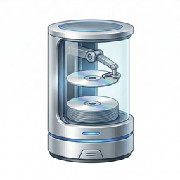
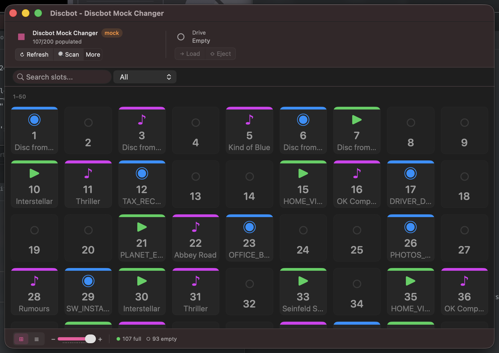

<p align="center">
  
</p>

<h1 align="center">Discbot</h1>

<p align="center">
  A macOS app for controlling SCSI media changer devices.<br>
  Built for the <a href="https://www.sony.com/electronics/support/home-video-media-changers/vgp-xl1b">Sony VGP-XL1B</a> 200-disc changer, but should work with other SCSI-compliant media changers.
</p>

<p align="center">
  
</p>

## Features

- **Visual inventory** — Grid and list views of all disc slots with color-coded status indicators
- **Disc operations** — Load, eject, mount, and unmount discs with a click or keyboard shortcut
- **Batch imaging** — Select any number of discs and image them sequentially, with safe return-to-slot cleanup after success, failure, or cancellation
- **Disc scanning** — Auto-detect disc type and volume label for any slot
- **Disc library** — Keep every disc sighting, rip attempt, output location, activity event, and collection statistic
- **Internet metadata** — Match audio CDs through MusicBrainz/Cover Art Archive and DVDs through TMDB, with searchable alternatives and manual editing
- **Verified duplicate protection** — Existing images are rechecked by recorded size and SHA-256 before they can be skipped
- **Safe replacement** — Replace an existing image only after the new rip has been written and verified, while retaining its history
- **Search and filter** — Find discs by name or filter by status (full, empty, imaged)
- **Zoom** — Adjustable grid tile size from compact to detailed
- **Keyboard navigation** — Arrow keys, Enter to load, Escape to deselect
- **Quit protection** — Warns before quitting during active operations and recovers gracefully from crashes

## Requirements

- macOS 10.15 (Catalina) through macOS 15 (Sequoia)
- A SCSI media changer connected via FireWire or Thunderbolt-to-FireWire adapter

> **Note:** macOS Tahoe (macOS 26) removed FireWire support. Discbot will compile on Tahoe but cannot connect to FireWire devices. A warning is shown at startup.

### Raw audio CD access

On macOS Catalina, add the installed `Discbot-Server.app` to **System
Preferences → Security & Privacy → Privacy → Full Disk Access**, then restart
the server. Catalina's System Policy can deny `/dev/rdisk*` to a headless
launch daemon even when its POSIX `operator` group permissions are correct.
This approval is persistent and is only required once for a stable app path.

macOS exposes optical-drive raw device nodes as read-only to the built-in `operator` group. Audio and mixed-mode CD imaging needs that access because it preserves complete 2,352-byte sectors rather than asking the filesystem to copy files. Configure the dedicated ripping account once:

```sh
./Scripts/install-raw-disc-access.sh
```

Then sign out and back in (or reboot) and verify the new login:

```sh
./Scripts/install-raw-disc-access.sh --check
```

This grants the account read access to all macOS raw disk device nodes; it does not grant write access. A dedicated account and machine are recommended for an unattended ripping appliance. To reverse the change, run `./Scripts/install-raw-disc-access.sh --uninstall`, then sign out and back in.

## Usage

### Connecting

On launch, Discbot automatically connects to the first detected SCSI media changer. The header shows the device name and slot count. If no device is found, click **Retry Connection**.

For testing without hardware, enable **Mock Changer** in Preferences (`⌘,`) to simulate a 200-slot changer.

### Inventory

The main window shows all disc slots. Switch between views using the footer toggle:

- **Grid view** — Compact tile grid with zoom slider. Tiles are color-coded: green = full, blue = in drive, red = exception, grey = empty.
- **List view** — Table with slot number, disc type, volume label, and imaging status.

Use the **search bar** to filter by volume label, or the **filter dropdown** to show only full, empty, or imaged slots.

### Loading and Ejecting Discs

- **Click** a slot to select it, then click **Load** in the header to move the disc into the drive
- **Double-click** a full slot to load it immediately (ejects any disc currently in the drive first)
- **Right-click** a slot for context menu options: Load into Drive, Scan Disc, Eject Disc, Eject Here
- Once loaded, use **Mount/Unmount** to control the filesystem and **Eject** to return the disc to its slot

### Imaging Discs

1. **Select discs** — Click to select one disc, `⌘-click` to toggle, `⇧-click` for range selection
2. Click the **Rip** button in the toolbar (or `⌘⌥I`)
3. Choose an output folder
4. Choose what to do when a verified rip exists: **Skip**, **Replace**, or **Keep Both**
5. Discbot loads each disc, identifies it, creates the appropriate image, releases it from macOS, and returns it to its original slot before continuing

The batch imaging sheet shows progress for each disc with elapsed time, file size, skipped duplicates, and overall status. Cancellation finishes the cleanup for the disc currently in the drive before the batch stops. If Discbot cannot safely return a disc, it halts the queue instead of risking operations against the wrong media.

Data discs and DVDs are imaged as ISO files. On Catalina, pure audio CDs are read through Apple's cddafs driver from a private, non-indexed mount and stored as a validated `.zip` containing lossless 16-bit/44.1 kHz AIFF track files. This preserves the audio and track boundaries without opening the Sony FireWire bridge's raw BSD device, an operation that can block the changer in the kernel. Mixed-mode CDs are reported as unsupported on this hardware path instead of risking a changer lockup. The server installer uses a restricted, localhost-only SSH key to place the launchd-supervised process in a login session because a plain background LaunchAgent cannot create that private mount on Catalina.

### Disc Library

Open **Changer > Disc Library** (`⌘Y`) to browse every disc Discbot has seen. The library records:

- A content- or TOC-derived disc fingerprint when the media can be read reliably
- Every sighting, with the date and changer slot
- Every rip attempt, including completed, failed, cancelled, or interrupted operations
- The output path and whether the image is still present

Use **Open** to open an existing image, **Reveal** to show it in Finder, or **Open Folder** when the containing folder still exists. The Library window also includes a chronological activity log and aggregate statistics. Automatic duplicate skipping only occurs for a reliable fingerprint with a completed rip whose recorded size and SHA-256 still match; BIN/CUE images verify both files. Legacy records and weak metadata-only matches remain visible but are never auto-skipped.

### Metadata and artwork

The web app's **Metadata sources** panel controls automatic lookup. Audio CDs use their table of contents to query MusicBrainz and obtain cover art from the Cover Art Archive; no API key is required. DVD lookup uses TMDB and requires a TMDB API Read Access Token. Either automatic source can be disabled without affecting local volume-label metadata.

Every library row has an **Edit** action. Search the appropriate provider, choose a candidate, then correct any title, artist/media type, year, genre, artwork, or description before saving. A saved choice is treated as a user edit so later inventory scans do not silently overwrite it.

Each completed rip gets a human-readable `<image-name>.metadata.json` sidecar next to the image. When artwork is available, Discbot also saves `<image-name>.cover.jpg`. Editing catalog metadata rewrites sidecars for every existing rip while leaving the verified disc image unchanged.

### Remote web server

Discbot can serve an authenticated web client from the Mac connected to the changer. Open **Discbot > Settings**, then:

1. Add one or more allowed rip destinations. These may be local folders or mounted SMB/NFS shares.
2. Enable **Allow browser control on the local network**.
3. Copy the generated access token.
4. Open `http://jacksons-mac-mini.local:8787` from another device and enter the token.

Remote clients can inspect inventory and library statistics, select loaded slots, choose **Skip**, **Replace**, or **Keep Both**, start one exclusive batch job, monitor it, refresh inventory, and request safe cancellation. They cannot submit arbitrary output paths: every job must use a destination explicitly allowed in the Mac app.

The web client's **Carousel** task provides software-driven bulk loading and
unloading for the Sony VGP-XL1B. Choose how many discs to load and Discbot uses
the next empty slots, opening the gate once per disc. For unloading, Discbot
presents one stored disc at a time and waits for confirmation that it has been
removed. Every movement is followed by a fresh inventory read before the queue
advances. A missed insertion becomes a retry/skip prompt, cancellation waits
for a safe command boundary, and neither case is treated as a power-cycle
fault. The optical drive must be empty before either operation begins.

The web client receives authenticated real-time updates over a Server-Sent Events stream rather than polling. Changer state and batch progress are pushed when they change, catalog updates are coalesced, heartbeat frames keep the connection alive, and the browser reconnects automatically after a network interruption.

To run without a visible window after configuring destinations, launch the app with:

```sh
/Applications/Discbot.app/Contents/MacOS/Discbot --server
```

For an always-on Mac, install the included idempotent per-user launch agent. It
starts the server at login, keeps it running, and writes logs under
`~/Library/Logs/Discbot`:

```sh
Scripts/install-server-launch-agent.sh --app "$HOME/Applications/Discbot-Server.app"
Scripts/install-server-launch-agent.sh --status
```

Use `--uninstall` to remove it. Discbot also holds a process-wide lock, so a
GUI launch and a managed server cannot both claim the SCSI changer. Connection
recovery retries transient read-only SCSI commands, never retries an ambiguous
media move, and reports whether hardware is missing, owned elsewhere, or needs
a power cycle.

Audio-CD ripping on Catalina requires the per-user LaunchAgent and a logged-in
desktop session because cddafs mounting is denied to system LaunchDaemons, even
when they run under the same non-root account. The installer automatically
removes an older daemon install when migrating to the agent.

If the Mac runs without a logged-in desktop session, Catalina cannot bootstrap
a per-user LaunchAgent over SSH. The boot-time daemon remains available for
data-CD/DVD ripping and catalog/web access, but not audio-CD ripping; it drops
privileges and runs Discbot as the invoking user:

```sh
sudo Scripts/install-server-launch-daemon.sh \
  --app "$HOME/Applications/Discbot-Server.app"
```

The daemon installer gracefully hands off a manually running server and
refreshes Catalina's application-firewall rule for the installed bundle.

The server advertises `_discbot._tcp` with Bonjour. It uses bearer-token authentication but plain HTTP, so expose it only on a trusted LAN. Use a VPN or TLS reverse proxy before making it reachable from outside that network.

### Keyboard Shortcuts

| Shortcut | Action |
|----------|--------|
| `⌘R` | Refresh inventory |
| `⌘⇧R` | Full SCSI scan |
| `⌘L` | Load selected slot |
| `⌘E` | Eject disc to slot |
| `⌘U` | Mount/Unmount disc |
| `⌘⌥I` | Rip selected discs |
| `⌘Y` | Open disc library |
| `⌘+` / `⌘-` | Zoom in/out |
| Arrow keys | Navigate grid |
| Enter | Load selected slot |
| Escape | Deselect |

## Build

Clone with submodules:

```sh
git clone --recurse-submodules https://github.com/toml0006/discbot.git
```

Build via Xcode CLI:

```sh
xcodebuild -project discbot.xcodeproj \
  -scheme Discbot \
  -destination 'platform=macOS' \
  -configuration Release \
  build
```

Or open `discbot.xcodeproj` in Xcode and build.

Run the hardware-free batch/catalog integration check against a built app with:

```sh
path/to/Discbot.app/Contents/MacOS/Discbot --self-test
```

## GitHub Release Builds

This repo includes a GitHub Actions release workflow at `.github/workflows/release.yml`.

- Trigger: push a tag matching `v*` (example: `v1.0.0`)
- Compatibility checks:
  - Binary must include both `x86_64` and `arm64`
  - `LSMinimumSystemVersion` must be `10.15` (Catalina)
- Output:
  - `Discbot-<tag>-macOS.zip`
  - `Discbot-<tag>-macOS.zip.sha256`
  - `Discbot-<tag>-macOS.dmg`
  - `Discbot-<tag>-macOS.dmg.sha256`
- Publishing:
  - Artifacts are uploaded to the workflow run
  - A GitHub Release is automatically created for tag pushes and attaches all artifacts

### Signing and notarization (optional but recommended)

If these GitHub repository secrets are present, release artifacts are Developer ID signed and notarized:

- `APPLE_CERTIFICATE_BASE64` — Base64-encoded `.p12` certificate export
- `APPLE_CERTIFICATE_PASSWORD` — Password for the `.p12`
- `APPLE_SIGNING_IDENTITY` — Developer ID Application identity name (for `codesign`)
- `APPLE_ID` — Apple ID used for notarization
- `APPLE_APP_SPECIFIC_PASSWORD` — App-specific password for that Apple ID
- `APPLE_TEAM_ID` — Apple Developer Team ID

If signing secrets are not configured, the workflow still publishes unsigned artifacts.
If signing secrets are configured but notarization secrets are not, artifacts are signed but not notarized.

Example:

```sh
git tag v1.0.0
git push origin v1.0.0
```

## See also

- [mchanger](https://github.com/toml0006/mchanger) — CLI tool and C library for controlling SCSI media changers

## License

MIT License — See [LICENSE](LICENSE) for details.
